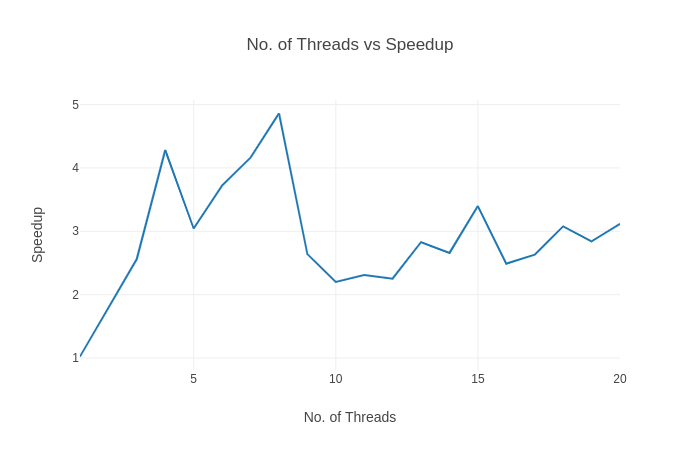

<html><head><meta content="text/html; charset=UTF-8" http-equiv="content-type"></head><body class="c24">

Parallel Computing Lab

Mohd Ubaid Shaikh

Under the Guidance of

Dr. Chandresh Kumar Maurya

Computer Science and Engineering

April 13, 2021

<h1 class="c22" id="h.tsop6d5wzhni">My Approach:</h1>
The input to the program is number of vertices and number of edges and then the edges given in separate lines as 
<table class="c7"><tbody><tr class="c13"><td class="c4" colspan="1" rowspan="1">
source destination weight
</td></tr></tbody></table>

And I am using the adjacency matrix representation of the graph. In the graph, weight(i, j) = INF if there is no edge from i to j. This graph &nbsp;(adjacency matrix) is passed to the shortest path algorithm.

<h3 class="c5" id="h.og0yne9bs53x">My Parallel Implementation:</h3>
We know that the following formula is the heart of the Shortest Path Algorithm:

&nbsp; &nbsp;

The algorithm works by first computing shortestPath(i, j, k)&nbsp;for all (i,j)&nbsp;pairs for k=0, then k=1, and so on. This process continues until k=N - 1, and we have found the shortest path for all (i,j)&nbsp;pairs using any intermediate vertices.

In this formula, we see that newer values of shortestPath(i, j, k)&nbsp;are dependent on the previous values of shortestPath&nbsp;computed for values of k&nbsp;less than current k. But, in each iteration of&nbsp;k, the values of i, j are independent from i, j&nbsp;of other iterations. Therefore, I have parallelized the iterations of i, j&nbsp;in the above formula using the following openmp directive

<table class="c7"><tbody><tr class="c13"><td class="c4" colspan="1" rowspan="1">
#pragma&nbsp;omp&nbsp;parallel&nbsp;for&nbsp;collapse(2) num_threads(NUM_THREADS)
</td></tr></tbody></table>

Here, collapse&nbsp;is for parallelizing both the loops (i&nbsp;and&nbsp;j)

<h1 class="c22" id="h.f59ya3a40g6p">Inputs and Outputs:</h1><h2 class="c17" id="h.x39k6itlm8id">Graph1:</h2>

<h3 class="c5" id="h.ney9ytrcd8bf">Input:</h3><table class="c7"><tbody><tr class="c13"><td class="c4" colspan="1" rowspan="1">
4 4 0 1 5 0 3 10 1 2 3 2 3 1
</td></tr></tbody></table>

<h3 class="c5" id="h.4s4kyxe8ge77">Output:</h3>

<h2 class="c17" id="h.3xjgszm4alwt">Graph2:</h2>

<h3 class="c5" id="h.259eth9mskb">Input:</h3><table class="c7"><tbody><tr class="c13"><td class="c4" colspan="1" rowspan="1">
10 21 0 7 4 0 9 8 1 2 13 1 5 -3 1 7 17 1 9 -11 2 0 9 2 1 46 3 8 12 4 1 40 5 0 3 5 3 7 5 8 -8 7 3 11 8 1 31 8 2 0 8 3 29 8 7 36 9 0 27 9 1 22 9 3 28
</td></tr></tbody></table>

<h3 class="c5" id="h.hffa0rrmgrsv">Output:</h3>

<h2 class="c17" id="h.emq4s515jpk1">Graph3:</h2>

<h3 class="c5 c16" id="h.5nkrov13hv4s"></h3><h3 class="c5" id="h.v380oqlsl2mk">Input:</h3><table class="c7"><tbody><tr class="c13"><td class="c4" colspan="1" rowspan="1">
50 100 0 24 56 1 4 31 1 22 115 1 26 71 2 36 42 2 38 130 2 43 144 3 4 124 3 38 -15 3 42 3 4 11 165 4 44 113 5 0 162 5 15 -19 5 32 88 6 0 98 7 37 -6 7 38 117 7 49 49 8 21 12 9 42 17 9 46 190 10 5 75 10 14 126 10 42 129 11 41 92 12 24 -2 12 33 -24 13 2 92 13 7 140 13 19 13 15 48 92 16 4 87 17 14 5 18 12 181 19 15 175 20 13 85 20 44 93 20 47 78 21 32 33 21 43 172 21 47 23 22 39 19 22 41 116 23 19 35 25 41 -37 25 43 108 26 2 0 26 7 84 26 42 149 27 5 48 27 42 -30 28 13 164 28 22 41 28 30 84 29 13 133 29 19 89 29 32 -19 29 42 80 30 3 128 30 27 182 32 0 160 32 15 84 32 47 53 32 48 -25 33 16 -6 33 24 19 34 3 -47 34 8 98 34 18 200 35 17 150 36 23 -30 37 23 48 37 46 -45 38 16 103 40 7 150 40 32 109 41 18 114 41 22 189 42 22 -8 42 30 104 42 38 -25 43 13 157 43 33 -26 44 0 84 44 47 156 45 15 66 45 29 78 45 35 48 46 17 161 46 49 88 47 3 25 47 15 14 47 31 53 47 49 145 48 6 134 48 8 196 48 34 91 48 37 160 48 49 193
</td></tr></tbody></table>

<h3 class="c5" id="h.w2f4woiadtt">Output:</h3>

<h1 class="c22" id="h.noyjz98a71bd">Big Inputs: </h1>
(These inputs are too big for pasting here, I request you to check in uploaded files)
<h2 class="c17" id="h.xdmeznwpooal">Outputs for Input1.txt, input2.txt and input3.txt:</h2><h2 class="c17" id="h.drkf9qhr4mwb"></h2>

<h2 class="c17" id="h.betrtlabeogl"></h2>

<h2 class="c17" id="h.23sf8e8doj9g"></h2>

<h1 class="c22" id="h.33jxb1muy8d0">Observing the Variation in Speedup, Parallel and Serial Time with respect to no. of Nodes and no. of Threads:</h1><h3 class="c25" id="h.rhxlrddhqi3b"></h3><h3 class="c5" id="h.q8zw2fvhqv1s">Speedup Vs No. of nodes (threads cnt = 8)</h3><h3 class="c5" id="h.fpmymtpsnice"></h3>

<h3 class="c5" id="h.2g7fhpcarsnk"></h3><h3 class="c5" id="h.xpty7wen6w13">No. of threads vs speedup (n = 500)</h3></body></html>
